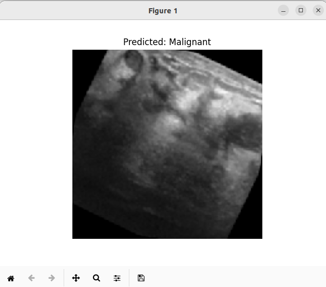

# Breast Cancer Detection Using Ultrasound Images

## Introduction

Breast cancer is one of the most common and life-threatening diseases among women worldwide. Early detection and diagnosis are crucial for increasing the survival rate and improving treatment outcomes. Traditional methods, such as mammography, have been widely used for breast cancer screening; however, ultrasound imaging offers a non-invasive and more accessible alternative, especially for dense breast tissues.

This project aims to develop a deep learning-based classifier to detect breast cancer using ultrasound images. The model leverages the VGG16 architecture, a pre-trained convolutional neural network (CNN), to extract features from the images, followed by custom dense layers to perform binary classification (malignant or benign).

## Dataset

The dataset used in this project is sourced from [Kaggle's Ultrasound Breast Images for Breast Cancer](https://www.kaggle.com/datasets/vuppalaadithyasairam/ultrasound-breast-images-for-breast-cancer). The dataset consists of ultrasound images categorized into two classes: malignant and benign. This dataset is highly valuable for building and testing machine learning models aimed at breast cancer detection.

## Model Architecture

The model is built upon the VGG16 architecture, known for its excellent performance in image classification tasks. The VGG16 model was pre-trained on the ImageNet dataset, and we used its convolutional base to extract features from the ultrasound images. The top layers were replaced with custom dense layers, including:

- **Flatten Layer**: To convert the 2D matrix to a 1D vector.
- **Dense Layer**: A fully connected layer with 512 neurons and ReLU activation function.
- **Dropout Layer**: A dropout layer with a 50% dropout rate to prevent overfitting.
- **Output Layer**: A single neuron with a sigmoid activation function to output the probability of the image being malignant.

The model was compiled using the Adam optimizer and binary cross-entropy loss, with accuracy as the primary metric.

## Training

The model was trained for 30 epochs with the following configuration:

- **Batch Size**: 32
- **Training Data Augmentation**: Included random rotations, width and height shifts, shear transformations, zoom, and horizontal flipping.
- **Validation**: The model's performance was validated using a separate validation dataset.

### Training Performance

Here are the results of the training process:

- **Final Training Accuracy**: 88%
- **Final Validation Accuracy**: 85%
- **Final Training Loss**: 0.30
- **Final Validation Loss**: 0.35


The model demonstrates strong performance, achieving high accuracy and low loss on both the training and validation datasets. However, some fluctuations in validation accuracy indicate potential room for further fine-tuning and optimization.

## Dependencies
The project relies on the following libraries:

TensorFlow: For building and training the deep learning model.
Keras: For high-level neural networks API.
Matplotlib: For visualizing the training process.
NumPy: For numerical computations.
PIL (Python Imaging Library): For image preprocessing.

Run the following command to install
```bash
pip install tensorflow keras matplotlib numpy pillow
```

## Train the Model

To train the model, run the following command
```bash
python3 train.py
```
Adjust the number of epochs in line number 62

## Inference 

To perform trained model inference, run the following command
```bash
python3 detect.py
```

## Results
Model produces good results, a sample is attached below.



## Conclusions 

This project demonstrates the effectiveness of transfer learning and deep learning techniques in medical image classification tasks. The model shows promising results in detecting breast cancer using ultrasound images, with potential applications in real-world clinical settings. Future work may involve further optimization, experimenting with different architectures, and deploying the model in a user-friendly application.
